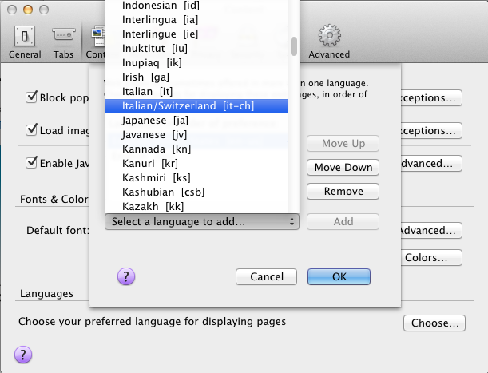

# Localization in action

## Using Our Strings

So first we developed, then our L10n team did some string wrangling, now we've got several locales with translated strings...

Now that our strings are in PO files, typically in a file system like this:

    locale
      en
        LC_MESSAGES
          messages.po
      de
        LC_MESSAGES
          messages.po
      pt_BR
        LC_MESSAGES
          messages.po

We need a way to get strings into our app at runtime. There are a few ways you can do this.

The first way, is to have server side strings and use the `gettext` function provided by `i18n-abide` as we saw in the first blog post.

The second way, is to have a build step which creates JSON language files out of our PO files. We've switched to this method for all our strings, because we had to support this for client side translation, which make up the majority of our string usage.

**Both of these methods require** the strings to be in a **JSON** file format. The server side translation loads them on app startup, and the client side translation loads them via HTTP (or you can put them into your built and minified JavaScript).

Since this system is compatible with GNU Gettext, a third option for server side strings is to use [node-gettext](https://github.com/andris9/node-gettext). It's quite efficient for doing server side translation.

So, how do we get our strings from PO into JSON files?

### po2json

Our build script is called `po2json.js`.

Example:

    $ locale/po2json.js static/i18n locale
    ...

And we get a file structure like:

    static
      i18n
        en
          messages.json
        de
          messages.json
        pt_BR
          messages.json

Wow, we've covered a lot of ground. Let's look at some deeper details...

-----------

## Config

`i18n-abide` requires some configuration to decide which languages are supported.

i18n-abide will do it's best to serve up an appropriate localized string. If it cannot, it will serve up the string you've put into your code and templates.

As we saw in the first isntallment, here is the required configuration for our app

    app.use(i18n.abide({
      supported_languages: ['en-US', 'de', 'es', 'zh-TW'],
      translation_directory: 'static/i18n'
    }));

This is an app that supports English, German, Spanish, Chinese (Traditional). The translated JSON files are under static/i18n.

You don't need the .PO files to be deployed to production, but it doesn't hurt to ship them.

## Start you engines

    npm start

In your web browser, change your preferred language.

Screenshot 1
Screenshot 2

### gobbledygook

If you want to **test** your L10n setup, **before you have real translations** done, we're built a great testing locale. It is inspired by David Bowie's Labrythn.

To use it, just add `it-CH` or another locale you're not currently using to your config as the **debug** locale.

Partial config showing `it-CH` is used in supported_languages and debug_lang.

    app.use(i18n.abide({
      supported_languages: ['en-US', 'de', 'es', 'zh-TW', 'it-CH'],
      debug_lang: 'it-CH',
      ...

Now if you set your browser's preferred language to Italian/Switcherland, i18n-abide will use gobbledygook to localize the content.

This is a handy way to ensure your design and copy work for bi-directional languages like Hebrew, before you have the resources to support that community.

## Going Deeper
We've just scratched the surface of i18n and l10n. If you ship a Node.js in multiple locales, you'll find many gotchas and interesting nuances.

Here is a heads up on a few:

## Format, gettext, ngettext

We haven't mentioned `format` yet. This is another JS function which `i18n-abide` injects. String interpolation is quite common in localizaing software.

Here are some examples:

    format(gettext('<a href="$s">Register with our partner $s</a>), 'https://example.com', 'Example');

We have regional partners and the name and url vary by locale.

    
(format(gettext('Welcome back, $s'), user.name);

We need to inject app or user data into strings.

    format(ngettext('You have $s followers', $s), $s);

Copy has plurals. `ngettext` captures this in the PO files as well as returning the correct translation based on the number of items.

## User's Preffered Language

What... so how do we know what the user's preferred language is?

The i18n-abide module looks at the `Accept-Language`
...

### Extracting Strings

We mentioned that you can use GNU Gettext's `xgettext` to extract your strings. This is how Persona did it originally.

Another wrinkle is that GNU Gettext doesn't know how to parse JavaScript or various flavors of Node templating languages.

If you do want to use xgettext, you'll want to parse JavaScript files as Perl and EJS files as PHP. See, I told you it was gnarly! Use jsxgettext instead.

That is why we wrote `jsxgettext`.

# Going Deep

## Bells and Whistles

How does one test that their site is ready for localizers? We've created a node module called `gobbledygook` which ...

[1] You could use variable names or something else, instead of the actual copy. Then you'd "localize" the English version, just like any other locale. This is not how it is done for Mozilla web services.

## Beyond Node.js

Many important aspects of Internationalization and Localization are things you should be aware of regardless of the programming language or framework.

It is important to work L10n into most phases of software development. When your designers have mockups, have a L10n guru review them.

A design should support Right to Left layout, instead of only a Left to Right composition. If you have a large call to action block on the left side of a page and other secondary blocks of content to support it... Then in Hebrew and other RTL languages, you'll want the layout mirrored, so that the call to action has the same impact. Some clever CSS can take advantage of the `dir` HTML attribute.

Images with text in them are expensive and problematic. An image or any container needs to be bulletproof. Idiomatic English might look great in that trendy faux sticker, but then adding the same content in German may not be possible as 4 letters have become 14.

Just like designers learned with data driven websites, where layouts and elements are filled with different content from the database... Designers often have to re-learn that even static elements like Banners and promotional links will vary in size.

Getting to clever with a design can add expense, especially if an asset is manually created for each locale. This doesn't scale and can slow down your deployment.

In addition to a code review, have developers or L10n team members review code regularly for proper use of Gettext. In addition to words, numbers and dates require special care. Everyone in the world doesn't format 5,000 like 5,000. Nor do they do that on Jan 5th, 2013.

Reviews will catch these early, getting them into your string catalogs like PO files in the correct format. Correcting this in the middle of localization can be a nightmare, as you have to try to update N number of PO files with N L10n teams with members who often aren't comfortable with version control.

Many teams have a code freeze to control quality and schedules. Similarly you need you developers and copy writers to coordinate with your L10n team. You should have a string freeze and plan on giving L10n enough time to do their work. Luckily, this can often overlap wtih your QA and Security testing.

Just like a code freeze, only exceptional situations should change copy in the app before pushing to production.

Continuous deployment for localized applications is not a solved problem. It is much easier to do scheduled deployments with L10n time backed in. You may have to wait until the slowest L10n team is done before deploying to production.