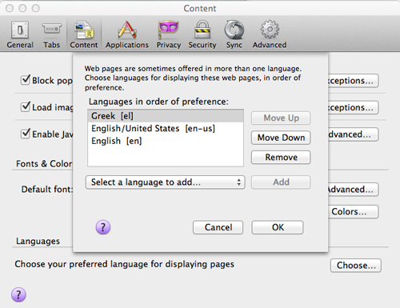
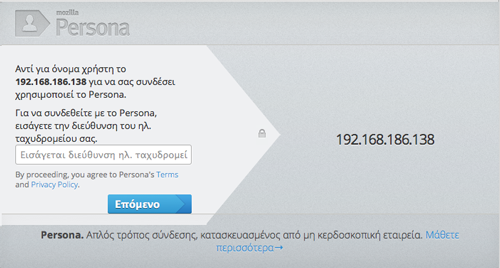
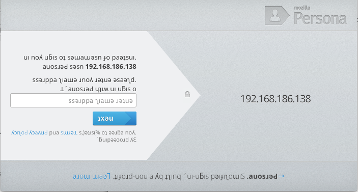

# Localization in action

## Using Our Strings

So first we developed, then our L10n team did some string wrangling, now we've got several locales with translated strings...

Let's get these strings ready for Node.js and see this puppy in action!

Typically in a file system like this:

    locale
      en
        LC_MESSAGES
          messages.po
      de
        LC_MESSAGES
          messages.po
      pt_BR
        LC_MESSAGES
          messages.po

We need a way to get strings in our PO files into our application at runtime. There are a few ways you can do this.

The first way, is to have **server side strings** and the `gettext` function provided by i18n-abide will work it's magic.

The second way, is to have **client side strings** and you'll include a gettext.js script in your code.
This is distributed with i18n-abide.

**Both of these methods require** the strings to be in a **JSON** file format.
The server side translation loads them on application startup, and the client side translation loads them via HTTP (or you can put them into your built and minified JavaScript).

Since this system is compatible with GNU Gettext, a third option for server side strings is to use [node-gettext](https://github.com/andris9/node-gettext). It's quite efficient for doing server side translation. We'll use the first option in this post.

### po2json.js

So, how do we get our strings from PO into JSON files?

Our build script is called `po2json.js`.

Example:

    $ locale/po2json.js static/i18n locale
    ...

And we get a file structure like:

    static
      i18n
        en
          messages.json
        de
          messages.json
        pt_BR
          messages.json

**Note:** You **don't need** the .PO files **to be deployed to production**, but it doesn't hurt to ship them.

The `static` directory is exposed to web traffic, so a request to `/i18n/es/messages.json` would get the Spanish JSON file.

You can do this via Node.js or a web server such as `nginx`.

## Configuration

`i18n-abide` requires some configuration to decide which languages are supported and to know where to find our JSON files.

As we saw in the first installment, here is the required configuration for our application

    app.use(i18n.abide({
      supported_languages: ['en-US', 'de', 'es', 'zh-TW'],
      translation_directory: 'static/i18n'
    }));

`supported_languages` tells the app that it supports English, German, Spanish, Chinese (Traditional).
The `translation_directory` config says that the translated JSON files are under static/i18n.
Note that `translation_directory` is needed for server side gettext only.

We explained in the first post that i18n-abide will do it's best to serve up an appropriate localized string.

It will look at `supported_languages` in the configuration to find the best language match.

You should only put languages in, where you have a locale JSON file ready to go.

## Start you engines

Okay, now that configs are in place and we have at least one locale translated, let's fire it up!

    npm start

In your web browser, change your preferred language to one which you have localized.

Now load a page for your application. You should see it translated now.

Here is Mozilla Persona in **Greek**. So, cool!

### gobbledygook

If you want to **test** your L10n setup, **before you have real translations** done, we're built a great test locale.
It is inspired by David Bowie's Labyrinth.

To use it, just add `it-CH` or another locale you're not currently using to your config under both `supported_languages` as well as the **debug_lang** setting.

Example partial config:

    app.use(i18n.abide({
      supported_languages: ['en-US', 'de', 'es', 'zh-TW', 'it-CH'],
      debug_lang: 'it-CH',
      ...

Now if you set your browser's preferred language to Italian/Switzerland (it-CH), i18n-abide will use gobbledygook to localize the content.

This is a handy way to ensure your design and copy work for bi-directional languages like Hebrew.
Your web designer can test their RTL CSS, before you have the resources to create actual Hebrew strings.

## Going Deeper
We've just scratched the surface of i18n and l10n.
If you ship a Node.js in multiple locales, you'll find many gotchas and interesting nuances.

Here is a heads up on a few more topics.

### String interpolation

i18n-abide provides a `format` function which can be used in client or server side JavaScript code.

Format takes a formatted string and replaces parameters with actual values at runtime.
This function can be used in one of two flavors of parameter replacements.

Formats
* %s - `format` is called with a format string and then an array of strings. Each will be replaced in order.
* %(named)s - `format` is called with a format string and then an object where the keys match the named parameters.

You can use `format` to keep HTML in your strings to a minimum.

Consider these three examples

    {{gettext('
Buy <a href="/buy?prod=blue&tyep=ticket">Blue Tickets</a> Now!
')}}
    
{{format(gettext('Buy <a href="%s">Blue Tickets</a> Now!', ['/buy?prod=blue&tyep=ticket']))
}}
    
{{format(gettext('Buy <a href="%(url)s">Blue Tickets</a> Now!', {url: '/buy?prod=blue&tyep=ticket'}))
}}

In the PO file, they produce these strings:

    msgid "
Buy <a href=\"/buy?prod=blue&tyep=ticket\">Blue Tickets</a> Now!
"
    msgid "Buy <a href="%s">Blue Tickets</a> Now!"
    msgid "Buy <a href="%(url)s">Blue Tickets</a> Now!"

The first example has a paragraph tag that shows up in the PO file. Yuck.
If you ever change the markup... you may have to update it in every locale!

Also, look at that ugly URL.

Reasons to use format:
* Avoid confusing localizers who aren't familar with HTML and may break your code accidentally
* Avoid maintenance issues

The named parameters are nice, in that they are self documenting.
The localizer knows that the variable is a URL.

String interpolation is quite common in localizing software.

Another example is runtime data injected into your strings.

    
{{format(gettext('Welcome back, %(user_name)s'), {user_name: user.name})}}

## Avoid Inflexible Design

We need to put our L10n hats on early.
As early as when we review the initial graphic design of the website.

Avoid putting copy into images. Use CSS to keep words as plain text positioned over images.

Make sure [CSS is bulletproof](). An English word in German can be many times larger and destroy a
poorly planned design.

Database backed websites have already taught us to think about systematic design way, but designers may not be used to
allowing for variable length labels or buttons.

Overly "tight" or clever designs simply will not work in a localized context.

## String Freeze

Remember our build step to prepare files for localizers to translate?
And in this post we learned about `po2json` for using these strings in our app...
Well, this means we're going to need to coordinate our software releases with our L10n community.

Continuous deployment isn't a solved problem with L10n. Either you have to block on getting 100%
of your strings translated before deploying, or be comfortable with a partially translated app in some locales.

L10n teams may need 2 or 3 weeks to localize your app, depending on how many strings there are.
Schedule this to happen during the QA cycle.

Provide a live preview site, so that localizers can check their work.

You should build a string freeze into your project schedule.

## Wrapping up

In these three blog posts, we've seen how to develop a localized app with `i18n-abide`.
How to add a L10n phase to our release build.
And lastly, how to test our work.

Localizing your website or application will make your site valuable to an even larger global audience.
Node.js hackers, go build some fun!